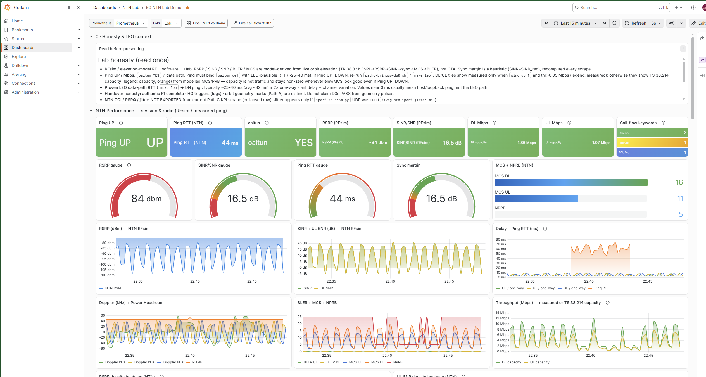
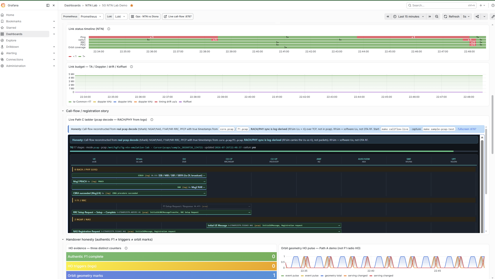
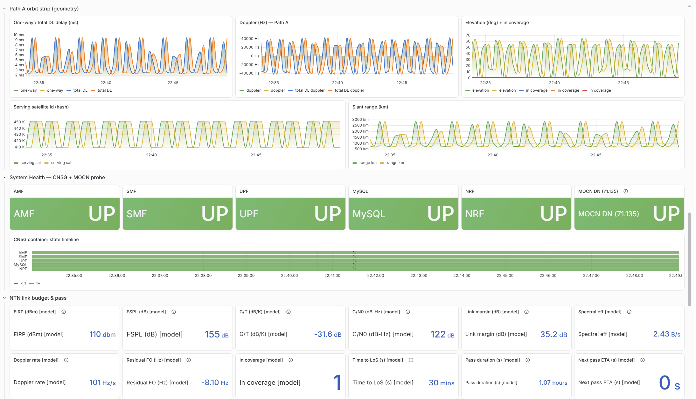
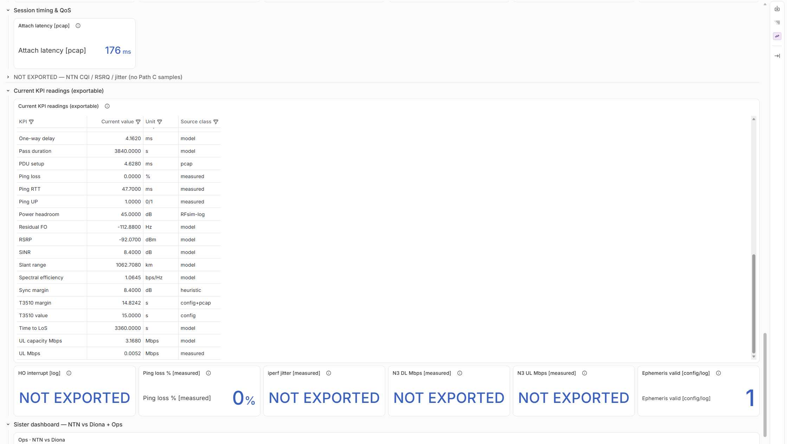
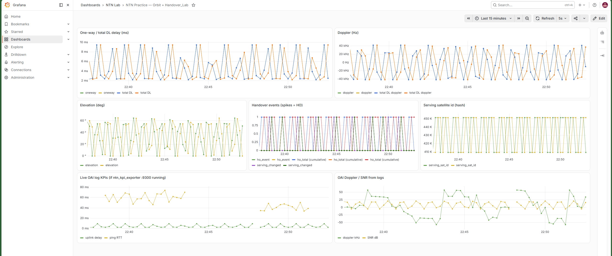
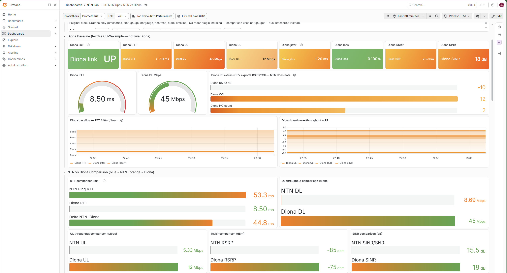
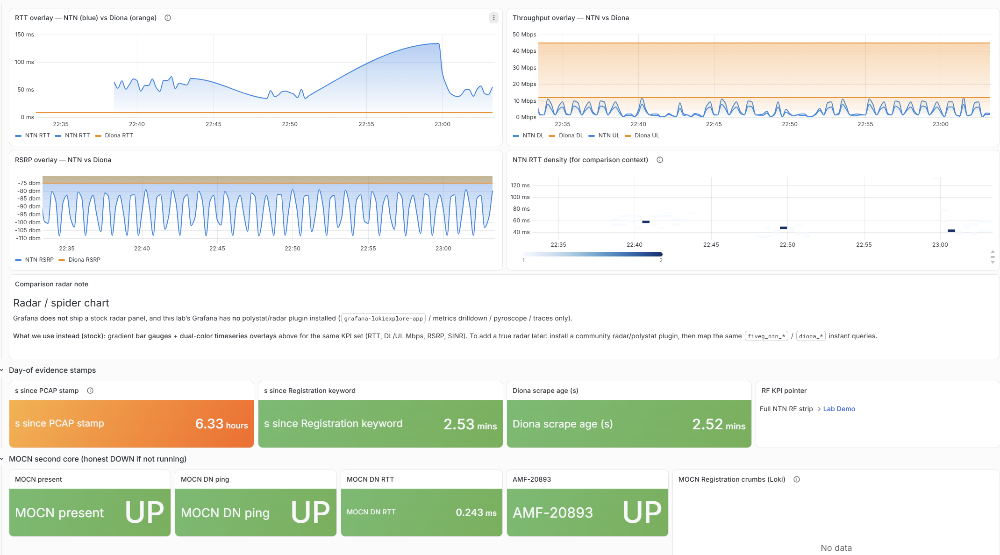
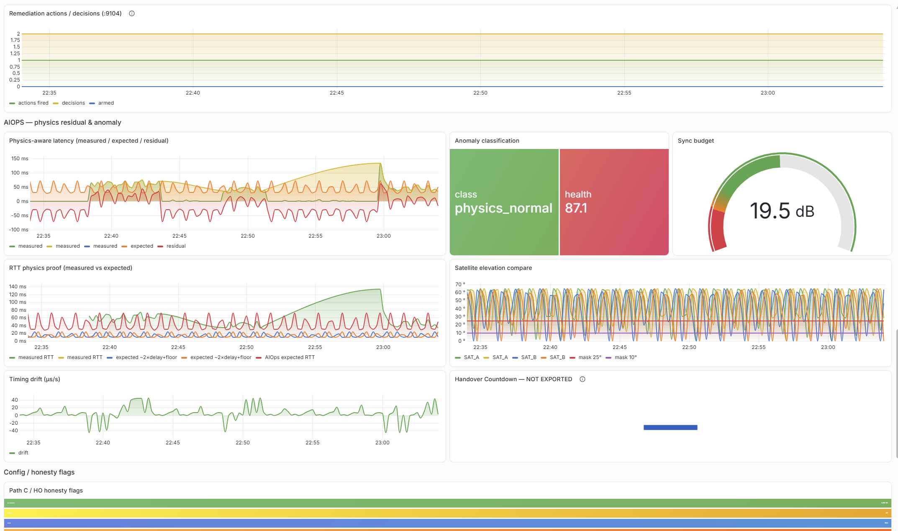

# Rel-17 5G NTN LEO Emulation Lab

### Software-only OpenAirInterface Path C (band 254, SAT_LEO RFsim) — attach, ping, labelled Grafana


---

## Table of Contents

1. [Overview](#overview)
2. [Live Demo](#live-demo)
3. [Project Structure](#project-structure)
4. [Key Findings](#key-findings)
5. [Project Report](#project-report)
6. [Dashboard Pages](#dashboard-pages)
7. [Tech Stack](#tech-stack)
8. [Installation & Local Setup](#installation--local-setup)
9. [Dataset](#dataset)
10. [Baseline comparison (Diona)](#baseline-comparison-diona)
11. [Deployment (Streamlit Community Cloud)](#deployment-streamlit-community-cloud)
12. [.gitignore Recommendations](#gitignore-recommendations)
13. [License](#license)
14. [Author](#author)

---

## Overview

This repository is a **GitHub-ready documentation and config pack** for a **3GPP Release 17 Non-Terrestrial Network (NTN) LEO** lab built on **OpenAirInterface (OAI)** and **RFsimulator**. It is **software emulation**, not over-the-air RF, not an SDR testbed, and not a live satellite ground station.

> **This is the public showcase — docs, configs, honesty notes, and demo media.** Operational bring-up / reproduce scripts live in a **private companion repo** (`5g-ntn-leo-lab-scripts`) and are **not** included here; they are available to reviewers **on request**. Do not paste secrets, keys, or `.env` files into either repo.

**Who it's for:**
- **RAN / NTN engineers** — Rel-17 SIB19, common Timing Advance, K-offset, Doppler pre-compensation, and Path C bring-up on band 254.
- **Systems / lab operators** — CU/DU split, OAI CN5G, `oaitun` user plane, and Grafana with **measured vs model** provenance.
- **Hiring managers / reviewers** — a concise, honest record of what was verified (LEO attach + ping) and what is a **tool limit** (green LEO dual-DU RFsim hub-and-spoke), not a project failure.

**Key capabilities:**
| Capability | Details |
|---|---|
| 🛰️ **Path C LEO attach** | Band **254** (~2.4884 GHz), `SAT_LEO_TRANS`, DU0 as RFsim **server**, UE as **client** |
| 📡 **Measured U-plane** | Ping **~25–80 ms** RTT via `oaitun_ue1` → DN **192.168.70.135** (often ~25–45 ms; ~32 ms cited; 0% loss on green runs) |
| 📐 **Rel-17 timing / FO** | SIB19, TA **~18.8 ms**, K-offset **40**, initial FO **~57 kHz**, HARQ **32** |
| 📊 **Labelled observability** | Grafana **Lab Demo**, **Live Topology**, **Super Ops**; Diona = **static** baseline |

**Orbit inject into RFsim is OFF.** Path C ping comes from the **SAT_LEO RFsim channel**, **not** from SGP4 driving the softmodem. The Grafana map/model KPIs share SGP4 geometry as a teaching/telemetry plane only.

---

## Live Demo

This pack does **not** host a public cloud app. The live demonstration is an Ubuntu lab:

| Surface | What you open |
|---|---|
| **Lab Demo** | Grafana `ntn-full-lab` |
| **Live Topology** | Grafana `ntn-live-topology` (SGP4 map — teaching plane) |
| **Super Ops** | Grafana `ntn-lab-super-ops` (ops + NTN vs Diona) |

Typical URLs (guest IP may be `192.168.122.128` or `.131`):

- `http://<vm-ip>:3000/d/ntn-full-lab`
- `http://<vm-ip>:3000/d/ntn-live-topology`
- `http://<vm-ip>:3000/d/ntn-lab-super-ops`

Login: **admin / admin**. Day-of capture: see [`docs/DEMO_PLAYBOOK.md`](docs/DEMO_PLAYBOOK.md).

### Lab demo video (26 Jul 2026)

Software-emulation walkthrough of Grafana Lab Demo / Live Topology / Super Ops (not OTA). GitHub’s file view plays `.webm` when you open the link; some README renderers also play the HTML control below.

**Download / play:** [`docs/media/lab-demo-2026-07-26.webm`](docs/media/lab-demo-2026-07-26.webm)

<video src="docs/media/lab-demo-2026-07-26.webm" controls preload="metadata" width="100%">
  Your viewer does not play inline video. Use the markdown link above:
  <a href="docs/media/lab-demo-2026-07-26.webm">lab-demo-2026-07-26.webm</a>
</video>

### Grafana snapshots (all eight from the Word pack)

Every image from [`docs/media/grafana-total-snaps.docx`](docs/media/grafana-total-snaps.docx), in document order. These are **software-emulation** Grafana captures (RFsim / model / measured ping), **not** over-the-air RF.

**Snap 1 — Lab Demo (session & radio).** Ping UP, RTT, oaitun, RFsim RF tiles, honesty banner.



**Snap 2 — Lab Demo (link status, Path C call-flow, HO honesty).** Timeline + reconstructed ladder; RFsim is software Uu, not OTA.



**Snap 3 — Lab Demo (orbit strip, CN5G health, modelled link budget).** Geometry / model KPIs plus core UP tiles.



**Snap 4 — Lab Demo (session timing & QoS table).** Attach latency and exportable KPIs with source class (measured / model / RFsim-log).



**Snap 5 — Orbit + handover practice board.** Delay, Doppler, elevation, serving-id, OAI log KPIs (teaching / log plane).



**Snap 6 — Super Ops (NTN vs Diona).** Diona is a **static labelled baseline**, not a live terrestrial scrape.



**Snap 7 — Super Ops (overlays, evidence stamps, MOCN).** RTT / throughput / RSRP overlays plus day-of stamps.



**Snap 8 — Super Ops (AIOps residual).** Measured vs geometry-expected RTT residual; lab tool, not a production AIOps claim.



Word source: [`docs/media/grafana-total-snaps.docx`](docs/media/grafana-total-snaps.docx). Extra stills: [`docs/medium-assets/`](docs/medium-assets/).

> **Demo success = Ping UP** through `oaitun` to `192.168.70.135`. RF Out-of-Service when elevation **&lt; 10°** can **coexist** with Ping UP (stale tunnel / policy-gated RF tiles). That is expected, not a silent bring-up fault.

---

## Project Structure

```
5g-ntn-leo-lab/
├── README.md
├── HONESTY.md                      # Scope, measured vs model, tool limits
├── LICENSE                         # All Rights Reserved
├── PUSH_TO_GITHUB.md               # How to publish (do not run until you choose)
├── 5g-ntn-leo-lab.code-workspace   # Public pack + private scripts folder
├── docs/
│   ├── DEMO_PLAYBOOK.md
│   ├── LAB_OVERVIEW_WHAT_HOW_GRAFANA_HONESTY.md
│   ├── LAB_PROGRESS_AND_KPI_FORMULAS.md
│   ├── MEDIUM_PUBLISH_READY.md     # Long-form write-up
│   ├── media/                      # Lab demo video + Grafana snap document
│   │   └── snaps/                  # All images extracted from the Word pack
│   └── medium-assets/              # Screenshot subset
├── monitoring/
│   ├── ntn/config/ntn.yaml         # Elev mask, carrier, link-budget constants
│   └── tle/sample_leo.tle          # Public ISS TLE for SGP4 teaching plane
├── oai-config/path-c/              # Path C confs (scripts are private)
└── OAI_ISSUE_RFSIM_DUAL_DU_HO/     # Dual-DU HO kit (markdown + evidence; scripts private)
```

Sibling **private** folder (separate git repo, not this clone): `../5g-ntn-leo-lab-scripts/` — Path C bring-up, issue reproduce `*.sh`, logging-only patch.

OAI source, CN5G images, and runtime logs live on the Ubuntu VM (`~/openairinterface5g`, `~/oai-config`, `~/monitoring`). This repo is the **portable record**, not a full VM clone.

---

## Key Findings

> Figures below are for **this** Path C configuration (band 254, ~600 km LEO design vector, 25 PRB, 15 kHz SCS). They are not universal NTN constants.

| Metric | Value / statement |
|---|---|
| **Path C ping** | **~25–80 ms** ICMP via `oaitun` → **192.168.70.135** |
| **Ping source** | **SAT_LEO RFsim** channel (`prop_delay` + motion term) — **not** SGP4-driven ping |
| **Orbit inject** | **OFF** — map does not steer the radio |
| **SIB19** | Broadcast satellite ephemeris (Rel-17 NTN) |
| **Common TA** | **~18.8 ms** (`ta-Common-r17`) |
| **K-offset** | **40** slots (`cellSpecificKoffset_r17`, ~40 ms at 15 kHz) |
| **Initial FO** | **~57 kHz** (`--initial-fo` ~57340 for this geometry) |
| **Band** | **254** (S-band MSS, ~2.4884 GHz) |
| **HARQ** | **32** processes |
| **Elevation mask** | **10°** — below → RF **OOS**; OOS can coexist with **Ping UP** |
| **Diona** | **Static** labelled CSV/example baseline — not a live terrestrial scrape |
| **Dual-DU HO (AWGN, UE-as-server)** | **PASS** |
| **Dual-DU HO (green LEO, DU0-as-server)** | **FAIL** — RFsim **hub-and-spoke** never forwards client→sibling IQ; **tool/scope limit, not a project failure** |
| **Scope** | Software emulation — **not OTA** |

---

## 📄 Project Report

A detailed, publish-ready write-up (architecture, Rel-17 state vector, Grafana provenance, fault-injection notes, dual-DU characterization) is here:

🔗 **Project report:** [`docs/MEDIUM_PUBLISH_READY.md`](docs/MEDIUM_PUBLISH_READY.md)

Companion honesty and KPI docs:

- [`HONESTY.md`](HONESTY.md)
- [`docs/LAB_OVERVIEW_WHAT_HOW_GRAFANA_HONESTY.md`](docs/LAB_OVERVIEW_WHAT_HOW_GRAFANA_HONESTY.md)
- [`docs/LAB_PROGRESS_AND_KPI_FORMULAS.md`](docs/LAB_PROGRESS_AND_KPI_FORMULAS.md)

### Radio vs handover comparison

| Recipe | Topology | Channel | Result |
|---|---|---|---|
| Path C day-of (green LEO) | DU0 **server**, UE **client** | `SAT_LEO_TRANS` | Attach + ping **PASS** |
| Dual-DU F1 HO | UE **server**, DUs **clients** | AWGN | HO **PASS** |
| Dual-DU F1 HO | DU0 **server**, UE + DU1 **clients** | Green LEO | HO **FAIL** — missing sibling DL samples in RFsim |

*Recommended claim for reviewers: Path C LEO U-plane is verified; green-LEO dual-DU HO is out of scope for this RFsim topology.*

---

## Dashboard Pages

### 1. 📊 Lab Demo (`ntn-full-lab`)

Primary teaching board for Path C.

- **Ping UP / RTT** — measured ICMP through `oaitun` to `192.168.70.135`
- **RF tiles** (RSRP, SINR, BLER, MCS) — **simulator / log / model** provenance, not OTA
- **Coverage policy** — elevation mask ~10°; RF zeros below the mask are expected when OOS
- Day-of Grafana snaps: [01](docs/media/snaps/01.png) · [02](docs/media/snaps/02.png) · [03](docs/media/snaps/03.png) · [04](docs/media/snaps/04.png)


### 2. 🗺 Live Topology (`ntn-live-topology`)

SGP4 teaching / telemetry plane.

- Sub-satellite point, ground UE, slant range, model delay/Doppler
- **Not** live GPS of a spacecraft and **not** the driver of measured ping
- Closest Word-pack snaps: orbit strip on Lab Demo [03](docs/media/snaps/03.png); practice orbit+HO board [05](docs/media/snaps/05.png). Geomap crop: [`docs/medium-assets/topology.png`](docs/medium-assets/topology.png)


### 3. âš™ Super Ops (`ntn-lab-super-ops`)

Ops view plus NTN vs terrestrial framing.

- Residual / AIOps panels (expected RTT from **geometry model** vs **measured** ping — hedged when planes diverge)
- **Diona** column is a **static** labelled baseline
- Day-of Grafana snaps: [06](docs/media/snaps/06.png) · [07](docs/media/snaps/07.png) · [08](docs/media/snaps/08.png)


---

## Tech Stack

| Technology | Purpose | Notes |
|---|---|---|
| **OpenAirInterface** | gNB CU/DU + nrUE | Pin ~**2026.w16** (`38dc378`); built with RFsim (`-w SIMU`) |
| **RFsimulator** | IQ over TCP + channel | Path C: `SAT_LEO_TRANS`; inject **OFF** |
| **OAI CN5G** | 5G SA core (Docker) | AMF/SMF/UPF; DN **192.168.70.135**; radio-agnostic in this lab |
| **3GPP Rel-17 NTN** | SIB19, TA, K-offset, FO, HARQ 32 | Band **254**, 25 PRB, 15 kHz SCS |
| **Prometheus** | Scrape exporters | `:9100` node, `:9300` KPI, `:9101` orbit |
| **Grafana** | Lab Demo / Live Topology / Super Ops | Folder **NTN Lab** |
| **SGP4 / TLE** | Map + model KPIs | Teaching plane only |
| **Python (optional)** | Orbit / KPI exporters on the VM | Not required to *read* this pack |

---

## Installation & Local Setup

> For reference only — full bring-up and reproduce scripts ship with the **private companion** (`5g-ntn-leo-lab-scripts`, available on request). This showcase repo contains **documentation, configs, and results** only.

### Prerequisites

- Ubuntu 22.04 lab VM with OAI built for RFsim, OAI CN5G, Docker, Prometheus/Grafana
- This GitHub pack (configs + docs) copied onto the VM under `~/oai-config` and `~/monitoring` as you already run them
- SSH from Windows to the guest (typical NAT `192.168.122.x`)

This repository **does not** vendor the OAI tree or CN5G images.

### Steps

```bash
# 1. Clone this public pack
git clone https://github.com/<your-username>/5g-ntn-leo-lab.git
cd 5g-ntn-leo-lab

# 2. Read scope first
less HONESTY.md
less docs/LAB_OVERVIEW_WHAT_HOW_GRAFANA_HONESTY.md

# 3. On the Ubuntu VM (runtime trees — not this laptop folder):
#    Place Path C confs under ~/oai-config/path-c/
#    Place ntn.yaml and sample TLE under ~/monitoring/...

# 4. Day-of Path C (green LEO attach + ping)
#    (With private scripts access) copy pathc-bringup-du0.sh onto the VM, then:
bash ~/oai-config/path-c/pathc-bringup-du0.sh
# Success line: OK: PING SUCCESS
# Ping: oaitun_ue1 → 192.168.70.135  (~25–80 ms)

# 5. Grafana capture
bash ~/demo/start-live-capture.sh
# Open Lab Demo / Live Topology / Super Ops on :3000
```

Configs in this pack: [`oai-config/path-c/`](oai-config/path-c/) (`.conf` only). Constants: [`monitoring/ntn/config/ntn.yaml`](monitoring/ntn/config/ntn.yaml). Open both trees locally with [`5g-ntn-leo-lab.code-workspace`](5g-ntn-leo-lab.code-workspace).

---

## Dataset

There is no customer CSV. Lab inputs in this pack:

| Property | Detail |
|---|---|
| **Path C confs** | CU / DU0 / DU1 / nrUE — band 254 NTN |
| **ntn.yaml** | Elevation mask **10°**, `f_c` **2.4884 GHz**, EIRP/G/T, UE lat/lon (~NYC) |
| **sample_leo.tle** | Public **ISS (ZARYA)** TLE for SGP4 **teaching** map |
| **Diona** | Static labelled baseline (not a live feed) |
| **Lab demo video** | [`docs/media/lab-demo-2026-07-26.webm`](docs/media/lab-demo-2026-07-26.webm) — recorded Grafana / lab walkthrough (~42 MB) |
| **Grafana snaps** | [`docs/media/snaps/`](docs/media/snaps/) — **8** PNGs extracted from [`docs/media/grafana-total-snaps.docx`](docs/media/grafana-total-snaps.docx) |

> TLE age degrades SGP4 accuracy. Refresh from a public TLE source when the epoch is stale. The TLE **does not** drive Path C ping.

---

## Baseline comparison (Diona)

Super Ops includes **Diona: a static, labelled CSV/example reference**, not a live Diona scrape. It frames NTN vs a terrestrial-style baseline. Do not treat Diona tiles as measured NTN.

Optional on-VM extras (Sionna notebooks, residual AIOps) are **lab tools**. They are not required to claim Path C ping.

---

## Deployment (Streamlit Community Cloud)

This project is **not** a Streamlit app and is **not** deployed on Streamlit Community Cloud.

**What “deploy” means here:**

1. Push this pack to GitHub (see [`PUSH_TO_GITHUB.md`](PUSH_TO_GITHUB.md)) — documentation, configs, screenshots.
2. Run the stack on an Ubuntu VM: OAI + RFsim + CN5G + Grafana.
3. Present Lab Demo / Live Topology / Super Ops locally (or over SSH/port-forward).

> This is **software emulation**, not OTA. Do not describe the GitHub repo as a live satellite network.

---

## .gitignore Recommendations

This pack already includes a `.gitignore`. Keep out of git:

```gitignore
# Captures and secrets
*.pcap
*.pcapng
*.mp4
*.tar.gz
.env
*.key
*.pem

# Operational scripts (private companion repo)
*.sh

# Python / OS
__pycache__/
.venv/
.DS_Store
Thumbs.db
```

Do not commit full VM logs, CN5G dumps, secrets, or videos over ~100 MB. The day-of lab demo (`.webm`, ~42 MB) and Grafana snap document live under [`docs/media/`](docs/media/). Bring-up and reproduce `*.sh` files belong in the **private** sibling repo, not this public clone.

---

## License / Rights

All Rights Reserved. This public repository is a showcase; see LICENSE. No permission is granted to use, copy, modify, or distribute any part of this repository without prior written consent.

## Author

Created by **Suresh Ramadolla**.

---

*Personal research and education project on OpenAirInterface. Software emulation of Rel-17 NTN LEO — not an over-the-air system, and not affiliated with or endorsed by any operator or vendor.*

