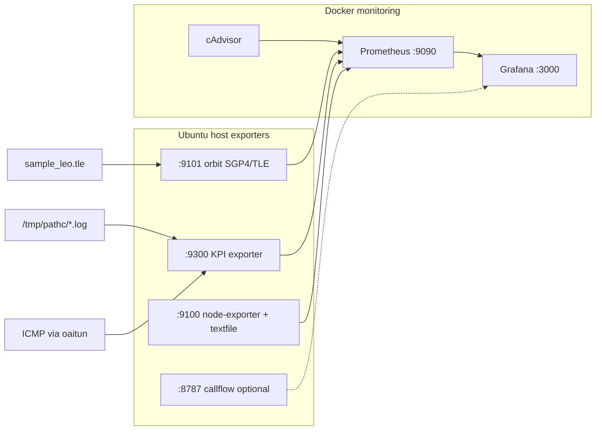

# 5G NTN Lab — What, How, Grafana & Honesty

**Audience:** presentations, newcomers, stakeholders  
**One-liner:** Software 5G SA NTN (LEO-style) lab — OAI radio + RFsim + CN5G + Prometheus/Grafana. Proven attach + ping. Not OTA, not SDR, not a real satellite ground station.

| Item | Value |
|------|--------|
| Live VM (typical) | `sureshramadolla@192.168.122.128` — DHCP may flip to **`.131`** |
| SSH key (Windows) | `C:\Users\sures\.ssh\id_ed25519_ntn` |
| Proven data path | Path **C** → `oaitun_ue1` → ping DN **`192.168.70.135`** (~25–80 ms, often ~25–45, 0% loss) |
| Day-of one command | `bash ~/demo/start-live-capture.sh` — see [`DEMO_PLAYBOOK.md`](DEMO_PLAYBOOK.md) |
| OAI pin | `38dc378` / **2026.w16** |
| Grafana login | `admin` / `admin` |
| Datasource UID (Grafana 13) | `PBFA97CFB590B2093` |

Commands live in runbooks (Section 8). This doc explains the story.

---

## 1. What is this setup?

### In plain English

We run a **full 5G Standalone stack in software** on an Ubuntu VM, with a **satellite-style radio channel** between the base station and the phone (UE). There is no antenna and no real satellite. IQ samples travel over a TCP socket called **RFsim**. Grafana shows live and model KPIs so you can demo and teach without claiming field RF.

### Pieces

| Piece | Role |
|-------|------|
| **UE** (`nr-uesoftmodem`) | Software “phone” — RFsim **client** on day-of Path C |
| **gNB CU** | Central unit — talks to core (NG) and to DU (F1) |
| **gNB DU0** | Distributed unit — band **254** NTN radio; RFsim **server** on day-of Path C |
| **RFsim** | Emulated air interface (IQ over TCP) + channel model `SAT_LEO_TRANS` |
| **CN5G** | OAI 5G core in Docker (AMF, SMF, UPF, …) — no satellite knowledge |
| **Prometheus / Grafana** | Scrape exporters → dashboards |

### Two machines

| Machine | What you do there |
|---------|-------------------|
| **Windows laptop** | Docs; browser for Grafana; PowerShell **SSH** into the VM; open PCAPs |
| **Ubuntu 22.04 VM** | Build/run softmodems, CN5G Docker, monitoring, ping, exporters |

```
Windows (edit · browser · SSH)
        │
        ▼ SSH
Ubuntu VM (everything runs here)
  ~/openairinterface5g   OAI softmodems (pin 2026.w16)
  ~/oai-config           Path C confs + bring-up
  ~/monitoring           Grafana/Prometheus (ONLY from here)
```

**Do not** start Grafana compose from VMware shared folder (`/mnt/hgfs/...`) — under OneDrive it is often empty and has wiped dashboards. Runtime trees: **`~/oai-config`**, **`~/monitoring`**.

### Path C = proven LEO-style attach + ping

**Path C** is the headline radio recipe: band **254**, CU + single **DU0**, UE, RFsim with `SAT_LEO_TRANS`. Bring-up script: `~/oai-config/path-c/pathc-bringup-du0.sh` (or `make leo`). Success line: **`OK: PING SUCCESS`**.

### What this is *not*

| Not this | Why |
|----------|-----|
| Over-the-air / SDR | No USRP, no RF cable — RFsim TCP only |
| Real satellite ground station | No dish, no feeder link, no operator TT&C |
| Live GPS of a sat on your map | Map uses **SGP4/TLE model** (default sample = public ISS) |
| Proof that capacity tiles = measured Mbps | Capacity is mostly **model**; ping/iperf are measured |

---

## 2. How we built it (high-level history)

Keep this short in a talk; point to runbooks for commands.

1. **Pinned OAI** — `openairinterface5g` at **~2026.w16** (`38dc378`). Softmodems built with RFsim (`-w SIMU`). Do not casually retag for demos.
2. **Path C configs** — under `oai-config/path-c/` (DU band 254, CU F1, UE). Proven LEO attach uses **DU0 as RFsim server**, UE as client.
3. **Monitoring stack** — Docker compose in **`~/monitoring`**: Prometheus, Grafana, Loki/Promtail, node-exporter, cAdvisor, blackbox.
4. **KPI + physics honesty** — `ntn.yaml` single source for elev mask, carrier, link budget; KPI exporter `:9300`; consistency flags so rosy margins cannot contradict bad SINR.
5. **Capacity model** — TS 38.214-style prediction gauges vs live/measured throughput when counters move.
6. **Orbit** — SGP4/TLE via orbit exporter **`:9101`** (`sample_leo.tle`); geometry is **separate** from RFsim (inject **OFF**).
7. **Live topology dashboard** — Grafana UID `ntn-live-topology` reads lat/lon/elev/range from `:9101`.

For day-of commands: [`LAB_BRINGUP_PATH_A_WORKING.md`](LAB_BRINGUP_PATH_A_WORKING.md) · [`LAB_BRINGUP_STEP_BY_STEP.md`](LAB_BRINGUP_STEP_BY_STEP.md).

---

## 3. What we have used (stack)

| Component | Where / port | Notes |
|-----------|--------------|--------|
| OAI `nr-softmodem` (CU, DU) | Ubuntu host | Path C CU + DU0 |
| OAI `nr-uesoftmodem` | Ubuntu host | UE + RFsim client |
| OAI **CN5G** | Docker | AMF `.132`, UPF, DN **`.135`** |
| **RFsim** | TCP ~`:4043` | Softmodem IQ channel — not OTA |
| **Prometheus** | `:9090` | Scrapes exporters |
| **Grafana** | `:3000` | Dashboards in folder **NTN Lab** |
| **node-exporter** | `:9100` | Host + textfile metrics |
| **KPI exporter** | `:9300` | Logs + ping + RF model chain |
| **Orbit exporter** | `:9101` | SGP4/TLE geometry (model) |
| **Call-flow ladder** | `:8787` | Optional live signalling view |
| **cAdvisor** | in compose | Container health |
| **Sionna / Diona** | optional | Side study / CSV baseline — not required for Path C green |

---

## 4. Config files — where and what

Workspace paths below; **on the VM**, prefer copies under **`~/oai-config`** and **`~/monitoring`** (do not rely on broken hgfs).

| Path | What it contains |
|------|------------------|
| `oai-config/path-c/gnb-du0.band254.ntn.pci0.conf` | DU0: band **254**, SSB/ARFCNs (`absoluteFrequencySSB` / PointA), PCI 0, RFsim + `SAT_LEO_TRANS` channel |
| `oai-config/path-c/gnb-du1.band254.ntn.pci1.conf` | DU1 for dual-DU / HO experiments (not day-of single-DU) |
| `oai-config/path-c/gnb-cu.sa.f1.conf` | CU SA: F1 to DUs, NG to AMF |
| `oai-config/path-c/nrue.ntn.rfsim.server.conf` | UE NTN / RFsim settings (USIM, RF params) |
| `oai-config/path-c/pathc-bringup-du0.sh` | **One script:** CN5G → CU → DU0 (RFsim server) → UE → wait `oaitun` → ping DN |
| `monitoring/docker-compose.monitoring.yml` | Grafana + Prometheus + Loki + node/cadvisor/… |
| `monitoring/prometheus.yml` | Scrape jobs: `:9100`, `:9300`, `:9101`, cadvisor, blackbox, … |
| `monitoring/ntn/config/ntn.yaml` | Elev mask **10°**, `f_c` **2.4884 GHz**, `L_extra`, EIRP/G/T, UE **lat/lon** (~NYC 40.71, −74.01), honesty notes |
| `monitoring/tle/sample_leo.tle` | Sample TLE (public **ISS ZARYA**) for SGP4 — replace for your sat |
| `monitoring/grafana/dashboards/ntn-full-lab.json` | Lab Demo dashboard |
| `monitoring/grafana/dashboards/ntn-lab-super-ops.json` | Ops / NTN vs Diona |
| `monitoring/grafana/dashboards/ntn-live-topology.json` | Live map / topology from orbit metrics |

Carrier for FSPL/Doppler must stay **2.4884 GHz** (band 254) — not a parallel 2.0 GHz “truth.”

---

## 5. How the lab is set up (data plane story)

### User-plane path (what “green” means)

```
CN5G (AMF/SMF/UPF … DN 192.168.70.135)
        ▲ N2 / N3
        │
       CU  (192.168.70.129)  — F1 to DU
        │
      DU0  RFsim SERVER  (band 254, SAT_LEO_TRANS)
        │  RFsim TCP IQ
       UE  RFsim CLIENT
        │
   oaitun_ue1  ──ping──►  192.168.70.135
```

Bring-up order (script prints OK lines):

1. **CN5G** up  
2. **CU** — NG Setup to AMF  
3. **DU0** — F1 Setup + RFsim server  
4. **UE** — attach → tunnel `oaitun_ue1`  
5. **Ping** DN → **OK: PING SUCCESS**

CN5G is **NTN-agnostic**: it sees a gNB with LEO-like delay/Doppler handled in RAN/UE (SIB19, TA, FO), not “a satellite” object.

### Orbit vs radio (important)

| Plane | What it does | Coupled to RFsim? |
|-------|--------------|-------------------|
| **SGP4 / TLE** (`:9101`) | Sat lat/lon, elev, range, model delay/Doppler for Grafana | **No** — inject **OFF** |
| **RFsim Path C** | Softmodem channel `SAT_LEO_TRANS` + LEO flags | Real attach/ping path |

Moving map ≠ changing the radio channel. Do not claim the dashboard steers the softmodem.

---

## 6. How Grafana runs and gets info

### Runtime rule

```bash
bash ~/monitoring/ensure-monitoring-up.sh
# or: cd ~/monitoring && docker compose -f docker-compose.monitoring.yml up -d
```

Compose working dir must be **`/home/.../monitoring`**, never hgfs.

### Scrape flow



ASCII (same idea):

```
TLE/SGP4 ──► orbit :9101 ──┐
 softmodem logs ──► KPI :9300 ──┼──► Prometheus :9090 ──► Grafana :3000
 ping oaitun / host ──────────┤
 node-exporter :9100 ─────────┘
```

### Dashboard URLs

Guest IP may be **`192.168.122.128` or `.131`** (DHCP). Discover with `arp -a | findstr 192.168.122` on Windows, then:

| Dashboard | URL pattern |
|-----------|-------------|
| Lab Demo | `http://192.168.122.XXX:3000/d/ntn-full-lab` |
| Ops / NTN vs Diona | `http://192.168.122.XXX:3000/d/ntn-lab-super-ops` |
| Live topology | `http://192.168.122.XXX:3000/d/ntn-live-topology` |
| Call-flow | `http://192.168.122.XXX:8787/` |
| Prometheus | `http://192.168.122.XXX:9090` |

Login: **admin / admin**. Datasource UID: **`PBFA97CFB590B2093`**.

---

## 7. Whatever Grafana shows — true or false? (honesty)

Use these words with stakeholders: **Measured**, **Model**, **Not exported**.

### TRUE / measured (trust for “session works”)

| What you see | Truth |
|--------------|--------|
| **Ping UP** / **ping RTT** via `oaitun` → DN `.135` | Live ICMP through the emulated path |
| **oaitun present** / UE tunnel up | Host interface / attach state |
| CN5G / Docker container up | cAdvisor / `docker ps` class signals |
| Host CPU/RAM, disk | node-exporter |
| **iperf Mbps** (when you ran iperf into textfile) | Measured for that run |
| Softmodem **alive** / log activity | Process + scraped log lines (presence), not field RF |

Verified Path C: ping **0% loss**, RTT typically **~25–80 ms** (often ~25–45 / ~32 ms cited). **Demo success = Ping UP** — not “all RF tiles green.”

### MODEL (real math — not OTA)

| What you see | Truth |
|--------------|--------|
| Sat **lat/lon/alt** on map | **SGP4 + TLE** (default ISS sample) |
| Elevation, slant range, one-way delay | Geometry from same model + `ntn.yaml` |
| FSPL, C/N₀, RSRP, SINR, link margin | Link-budget formulas from elev/range/`f_c`/`L_extra` |
| **DL capacity (prediction)** | TS 38.214-style model; may show when U-plane is down |
| Doppler (model gauges) | From geometry / configured FO chain — not a spectrum analyzer |
| Diona / orange baseline panels | Offline CSV baseline — **not** a live Diona scrape |
| RFsim log RSRP/SINR/BLER/MCS | Simulated radio from softmodem logs — useful demo, **not** field RF |

Honesty line for topology: *“Satellite position and link geometry are an SGP4/TLE model — not live OTA GPS, and not RF injection into Path C.”*

### NOT EXPORTED / do not claim

| Topic | Status |
|-------|--------|
| CQI, RSRQ | Not exported (unless you add collectors) |
| True HO interruption ms from air | Not a live OTA metric; distinguish F1 complete vs triggers vs orbit marks |
| Attach / PDU latency from PCAP as live Grafana gauges | Deferred / evidence offline — see LAB_POLICY TODOs |
| RACH/RRC collector suite as always-on Grafana | Not the default day-of path |
| “Map controls the satellite radio” | False — inject OFF |
| GEO air attach on this pin | **FAIL** (errno 14) — do not demo as PASS |
| SAT_LEO dual-DU F1 HO complete (D3c) | **FAIL** — do not invent PASS; AWGN dual-DU HO is the HO demo |

### Out-of-sync traps (say these out loud)

| Trap | What’s going on |
|------|------------------|
| **Map moving while ping DOWN** | Orbit exporter keeps SGP4 ticking; radio/PDU can be dead. Geometry ≠ U-plane. |
| **ISS TLE + NYC → elev &lt; 10° / RF zeros** | Sample sat + NYC lat/lon often below mask → `rf_oos=1`, MCS/capacity gated — **expected**, not a Grafana bug. Demo success = **Ping UP**. |
| **Capacity tile high, measured thr low/zero** | Prediction @ N_PRB=25 vs live. Need iperf for measured Mbps. Check `service_state` / `model_tput_scope`. |
| **Tunnel up + elev &lt; 10°** | Grafana may show `service_state=ZOMBIE` (**oaitun present while RF OOS**) even when **ping works** — model honesty. Distinct from classic **zombie U-plane** (oaitun + **100% ping loss** → clean STOP + pathc). |
| **Grafana UI up, panels empty** | Exporters down (`:9300` / `:9101`) or Prometheus not ready — not “no radio.” |
| **Wrong VM IP (.128 vs .131)** | DHCP flap — browser/SSH to wrong address looks like “lab dead.” |

Policy source: [`LAB_POLICY.md`](LAB_POLICY.md) · catalog: [`KPI_CATALOG.md`](KPI_CATALOG.md).

**Stakeholder sentence:** *“Green ping proves the emulated LEO 5G data path on OAI+RFsim+CN5G. Grafana mixes measured session health with honest physics models. This is not an OTA satellite campaign.”*

---

## 8. Pointers to other docs

| Doc | Use when |
|-----|----------|
| [`DEMO_PLAYBOOK.md`](DEMO_PLAYBOOK.md) | ★ Day-of: `start-live-capture`, what to show, Ping vs OOS speech, zombie recovery |
| [`LAB_BRINGUP_PATH_A_WORKING.md`](LAB_BRINGUP_PATH_A_WORKING.md) | Copy-paste Path A whole-lab bring-up (IP discovery, monitoring + pathc) |
| [`LAB_BRINGUP_STEP_BY_STEP.md`](LAB_BRINGUP_STEP_BY_STEP.md) | Layman bring-up architecture + numbered steps |
| [`LAB_CLEANUP_STEP_BY_STEP.md`](LAB_CLEANUP_STEP_BY_STEP.md) | Kill lab / prune disk safely |
| [`LAB_LIVE_TEST_PING_IPERF_SIONNA.md`](LAB_LIVE_TEST_PING_IPERF_SIONNA.md) | Ping → safe iperf → optional Sionna/Diona → capture |
| [`UBUNTU_TO_WINDOWS_COPY_SSH.md`](UBUNTU_TO_WINDOWS_COPY_SSH.md) | scp / SSH copy between VM and Windows |
| [`LAB_POLICY.md`](LAB_POLICY.md) | KPI honesty, OOS gating, elev 10°, inject OFF |
| [`KPI_CATALOG.md`](KPI_CATALOG.md) | Metric names, units, measured vs model |
| [`updated-docs/`](updated-docs/) | Engineer pack 00–11 (architecture → Grafana panels) |
| [`GRAFANA_STABLE_VS_MODIFICATIONS.md`](GRAFANA_STABLE_VS_MODIFICATIONS.md) | `~/monitoring` only; never empty hgfs |
| [`NTN_LIVE_TOPOLOGY_DASHBOARD_MOCKUP.md`](NTN_LIVE_TOPOLOGY_DASHBOARD_MOCKUP.md) | Live topology (`ntn-live-topology`) + mockup + SGP4 honesty |
| [`DOCUMENTATION_INDEX.md`](DOCUMENTATION_INDEX.md) | Full doc map |

---

*End of overview. For commands, open a bring-up runbook — do not invent steps from memory during a live demo.*
